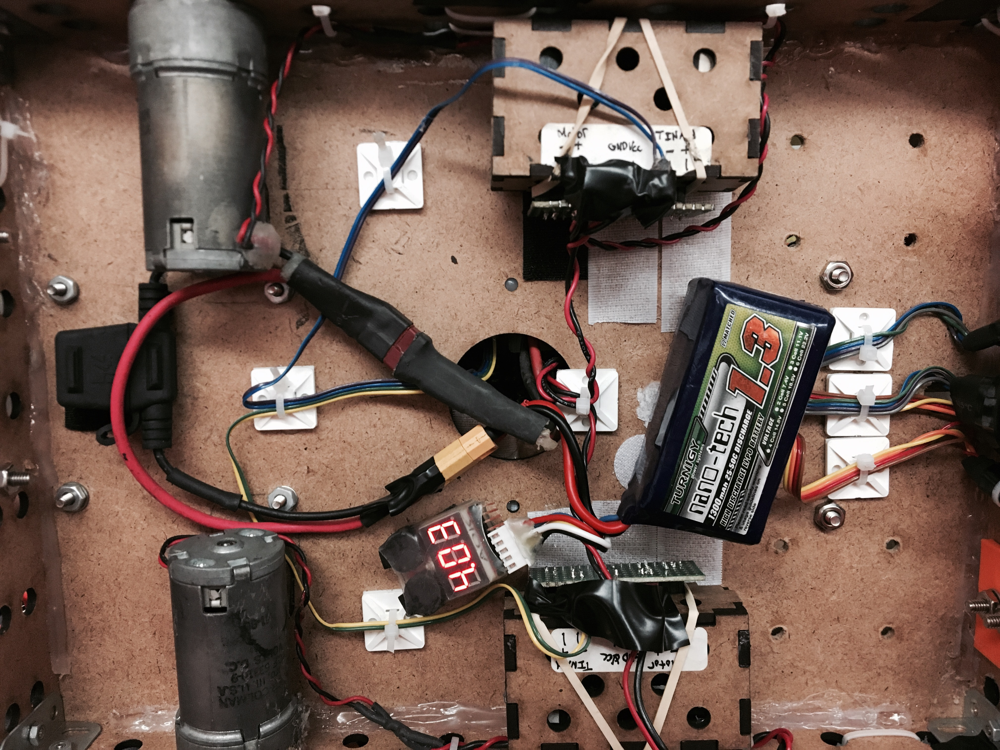
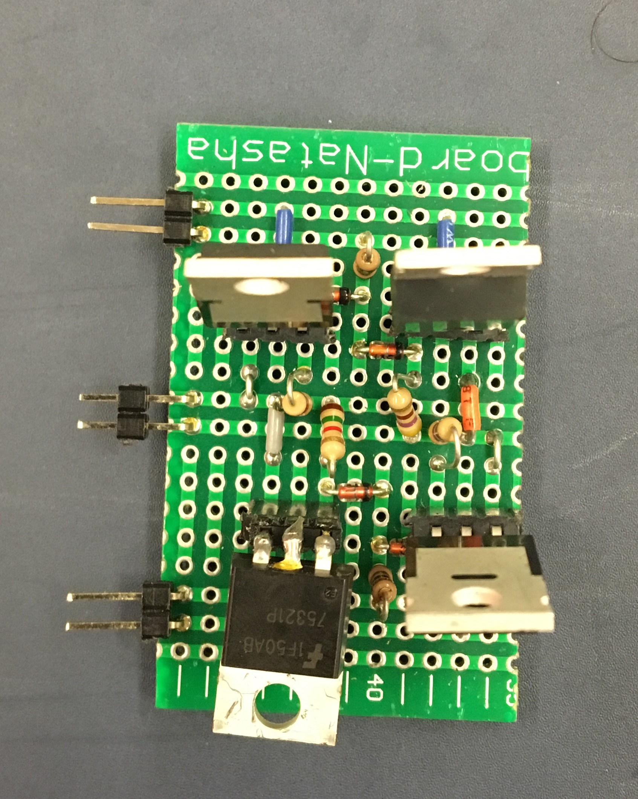

[Return to Homepage](index.md)
# Electrical

Simple and organized are two adjectives that we would use to explain Calvin's overall electrical design.

## TIHAH Microcontroller

The microcontroller we used was a modified arduino board with inputs and other features attached to a secondary custom pcb. Features included knob's to be used for optional adjustments as well as an LCD screen. The pinout of the board used is shown above.

## H-Bridge

The construction of an H-Bridge was needed to handle a high input voltage and current that would power the motors. The reason would could not do this directly from the microcontroller was because it would damage the board.

The design of the H-Bridge included the use of zener diodes and mosfets to regulate the amount of power the motors would output. A PMW (Pulse Width Modulation) voltage source was connected from the TINAH to the H-Bridge which was able to be modulated in software to set the speed our motors would run at. The average peak voltage we were able to run our motors on was around 16.5 Volts. The schematic of our H-Bridge is shown above.

## IR Filter

The IR filter we designed is meant to be able to tell the difference between a 10 kilo-hertz and 1 kilo-hertz infrared sine wave emitted from an IR beacon. To do this we designed our cirucit to output two signals. One of the signals would filter out frequencys lower and higher than 10 kilo-hertz and the other signal would filter out frequencys lower and higher than 1 kilo-hertz. We then connected these signals to two analog inputs on our TINAH board. In our software we programmed a function by  making an if statment where if the 10 kilo-hertz signal is a higher voltage than 1 kilo-hertz signal the function will return true. This allowed our filter to be very accurate even at larger distances as well as being accurate even if the robot was turn slightly to the right or left. It was able to do this because even if the voltages coming from the signals were to change, they would change proportionally. So if the signal coming from the beacon was 10 kilo-hertz and you turned the robot, both of the voltages would go down but the 10 kilo-hertz voltage would always be slightly larger than the 1 kilo-hertz voltage. A schematic of our IR filter is shown above.

[Return to Homepage](index.md)
