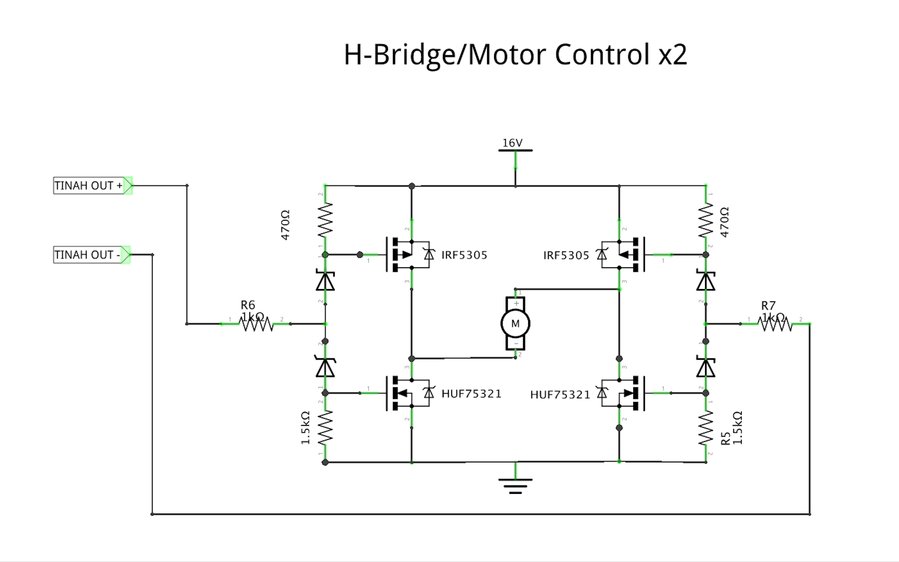
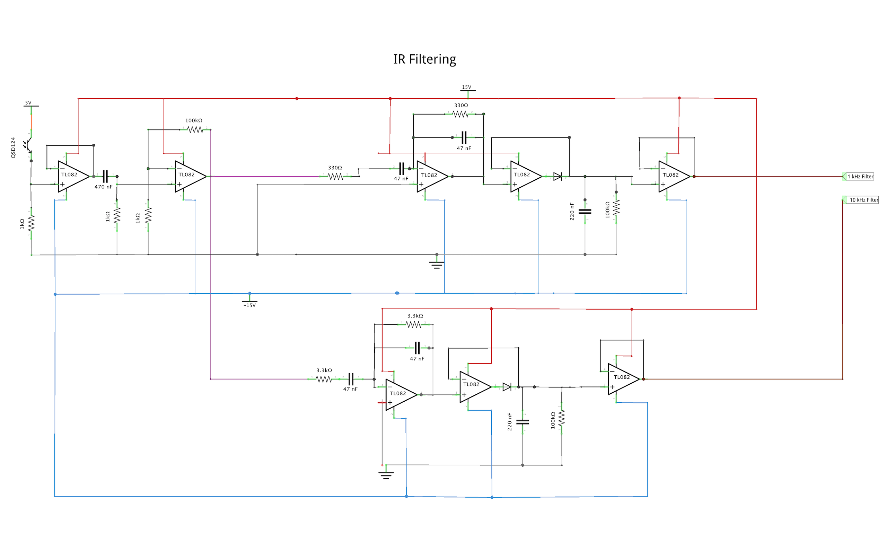

# Electrical

Simple and organized are two adjectives that we would use to explain Calvin's overall electrical design.

## TIHAH Microcontroller

The microcontroller we used was a modified arduino board with inputs and other features attached to a secondary custom pcb. Features included knob's to be used for optional adjustments as well as an LCD screen. The pinout of the board used is shown above.

## H-Bridge

The construction of an H-Bridge was needed to handle a high input voltage and current that would power the motors. The reason would could not do this directly from the microcontroller was because it would damage the board.

The design of the H-Bridge included the use of zener diodes and mosfets to regulate the amount of power the motors would output. A PMW (Pulse Width Modulation) voltage source was connected from the TINAH to the H-Bridge which was able to be modulated in software to set the speed our motors would run at. The average peak voltage we were able to run our motors on was around 16.5 Volts.

## IR Filter

The 

