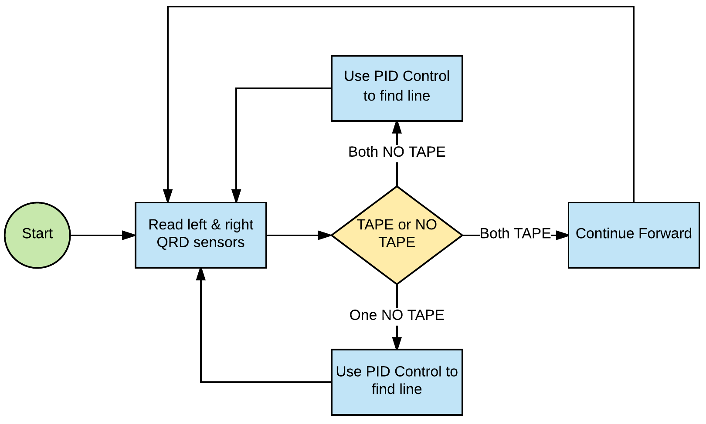
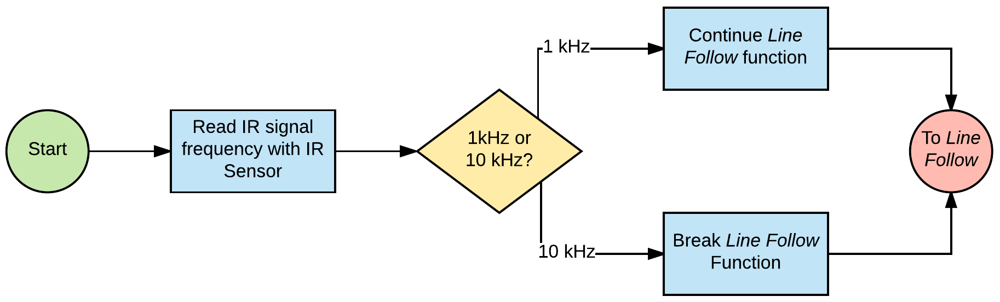
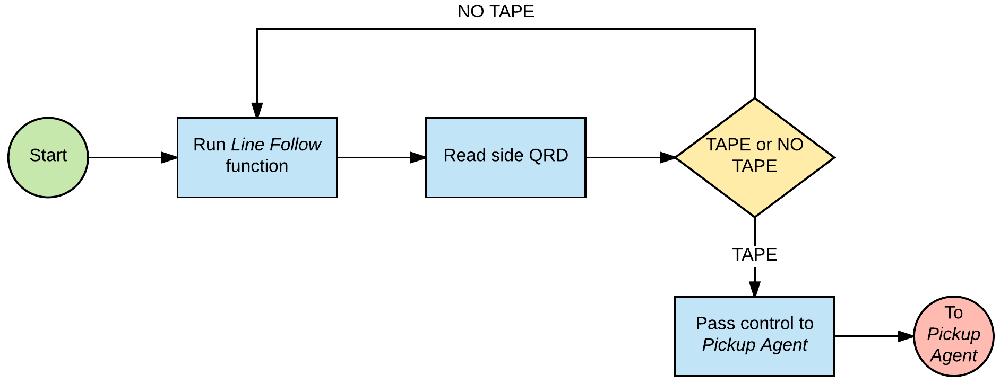
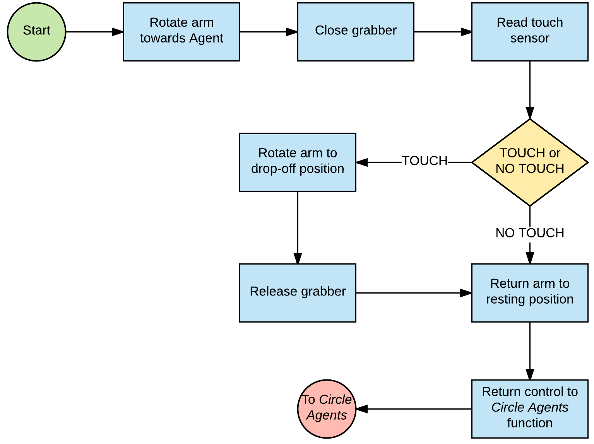
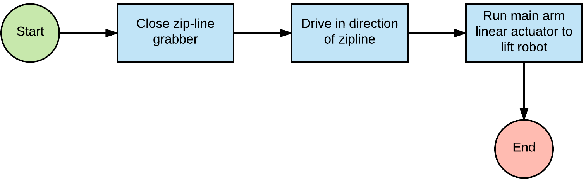
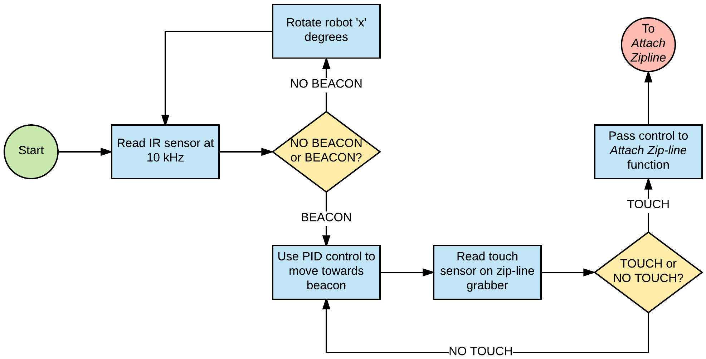

## Software

CALVIN's source code was written entirely in the Arduino environment in C. CALVIN's code allows him to function as a finite state machine, with different states corresponding to the different tasks CALVIN can complete. These states are detailed below.

### Line Follow

*Line Follow* is used for all parts of the course where CALVIN needs to line follow. This function reads the front inside QRD sensors to determine what direction CALVIN should move in. 

*Line Follow State Loop*

### Check Alarm

*Check Alarm* is used when the CALVIN stops at the alarmed gate to read the IR beacon corresponding to the gate. This function compares two analog readings from IR filtering circuits for both 1kHz and 10 kHz signals, and CALVIN continues line following once this function returns a 1 kHz signal.

*Check Alarm State Loop*

### Circle Agents

*Circle Agents* is used when CALVIN enters the circle where agents are located and line follows around to pick them up. *Circle Agents* runs until a **Stop Line** is detected, and then stops and calls the *Pickup Agent* function.

### Pickup Agent

*Pickup Agent* moves CALVIN's arm, claw, and crane in order to pickup an agent located on a platform. Once CALVIN has done this, the function returns to the *Circle Agents* function.

### Find Zipline

*Find Zipline* is called by *Circle Agents* once all agents have been picked up. This moves CALVIN to the zipline in order to drop off the bag full of agents on thee zipline, then calls *Attach Zipline*.

### Attach Zipline

*Attach Zipline* makes CALVIN use his arm to lift the bag full of agents to the zipline, then lets go of the bag to complete the course.

### Source Code

You can view CALVIN's source code [here](https://github.com/KeenanMcConkey/CALVIN/blob/master/code/CALVIN_Final.ino).

### Navigation

[Return to Home Page](index.md)
